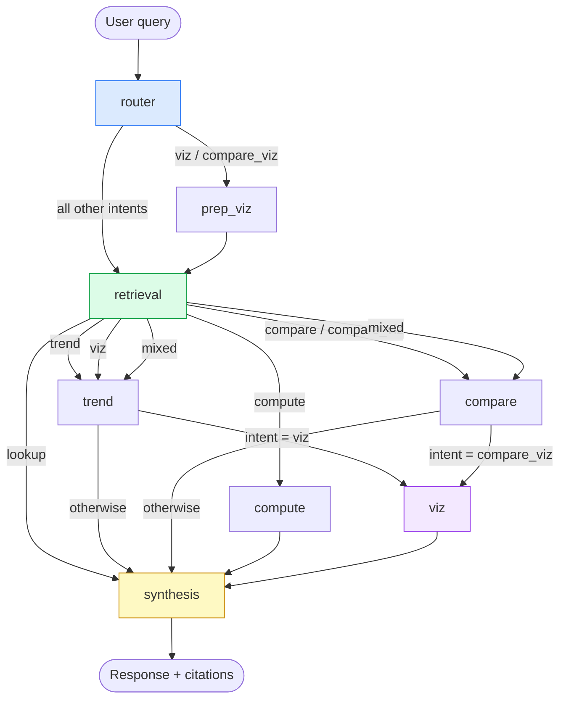
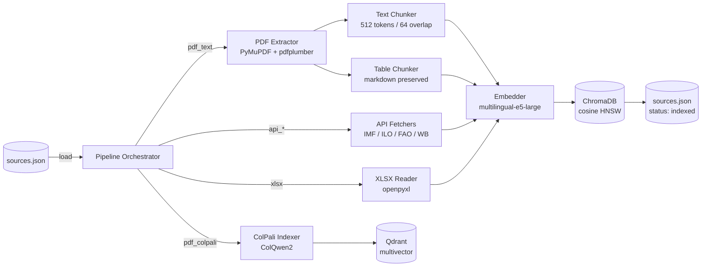
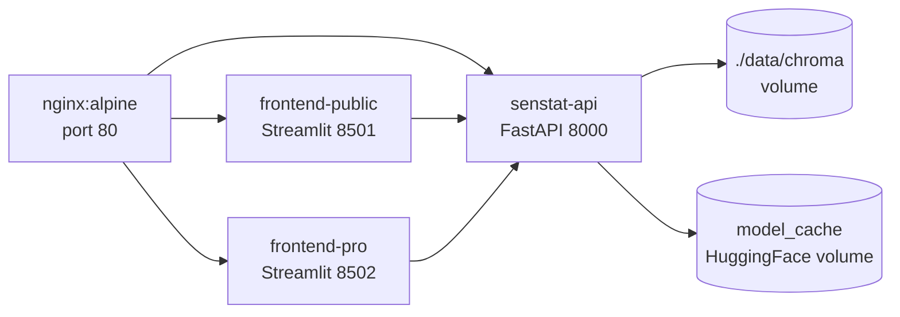
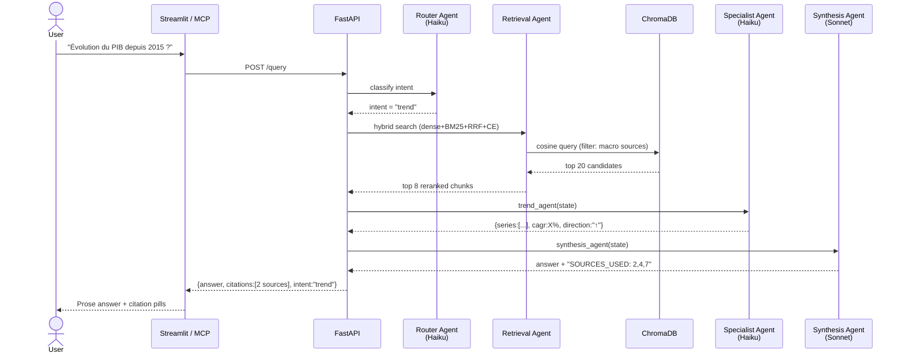

# SenStat — Architecture Documentation

> **SenStat** is a RAG-powered multi-agent system that answers questions about official
> Senegalese statistics, grounding every response in source documents with precise citations
> (institution · report · page number).

---

## Table of Contents

1. [System Overview](#1-system-overview)
2. [Repository Layout](#2-repository-layout)
3. [Agent Pipeline (LangGraph)](#3-agent-pipeline-langgraph)
4. [Retrieval Strategy](#4-retrieval-strategy)
5. [Ingestion Pipeline](#5-ingestion-pipeline)
6. [Data Sources Registry](#6-data-sources-registry)
7. [API Layer](#7-api-layer)
8. [Infrastructure & Deployment](#8-infrastructure--deployment)
9. [MCP Server](#9-mcp-server)
10. [Tech Stack Reference](#10-tech-stack-reference)
11. [Environment Variables](#11-environment-variables)
12. [Data Flow — End to End](#12-data-flow--end-to-end)

---

## 1. System Overview

```
┌─────────────────────────────────────────────────────────────────────┐
│                         Clients                                     │
│                                                                     │
│   Browser ──── Streamlit Public (8501)    Claude Desktop ─── MCP   │
│   Browser ──── Streamlit Pro   (8502)     Claude Code    ─── MCP   │
│   Any HTTP ─── FastAPI REST    (8000)                               │
└───────────────────────────┬─────────────────────────────────────────┘
                            │  POST /query  { query, messages }
                            ▼
┌─────────────────────────────────────────────────────────────────────┐
│                     FastAPI (api/main.py)                           │
│                  asyncio.to_thread → LangGraph                      │
└───────────────────────────┬─────────────────────────────────────────┘
                            │
                            ▼
┌─────────────────────────────────────────────────────────────────────┐
│                   LangGraph StateGraph                              │
│                                                                     │
│  router → [prep_viz] → retrieval → trend ──────────────► synthesis │
│                                  → compare ────────────► synthesis │
│                                  → compute ────────────► synthesis │
│                                  → [viz] ──────────────► synthesis │
│                                  → synthesis (lookup)              │
└───────────────────────────┬─────────────────────────────────────────┘
                            │
              ┌─────────────┴──────────────┐
              ▼                            ▼
   ┌──────────────────┐        ┌───────────────────────┐
   │  ChromaDB        │        │  Anthropic Claude API  │
   │  (dense + BM25)  │        │  Haiku  → router       │
   │  7 571 chunks    │        │  Sonnet → all others   │
   │  multilingual-e5 │        └───────────────────────┘
   └──────────────────┘
```

---

## 2. Repository Layout

```
senstat/
├── agents/                  # LangGraph multi-agent system
│   ├── graph.py             #   StateGraph definition & routing logic
│   ├── state.py             #   AgentState TypedDict
│   ├── router_agent.py      #   Intent classification (Claude Haiku)
│   ├── retrieval_agent.py   #   Hybrid search + CrossEncoder reranking
│   ├── trend_agent.py       #   Time-series extraction, CAGR (Claude Haiku)
│   ├── compare_agent.py     #   Entity comparison, gap calculation (Claude Haiku)
│   ├── compute_agent.py     #   Python sandbox — projections / ratios
│   ├── viz_agent.py         #   Plotly chart generation
│   └── synthesis_agent.py   #   Final answer + citations (Claude Sonnet)
│
├── api/                     # FastAPI REST layer
│   ├── main.py              #   App factory, CORS, router mounts
│   ├── routes/
│   │   ├── query.py         #   POST /query
│   │   ├── documents.py     #   GET  /documents
│   │   └── health.py        #   GET  /health
│   └── schemas.py           #   Pydantic models
│
├── ingestion/               # Data pipeline
│   ├── pipeline.py          #   Main orchestrator (all source types)
│   ├── extractors/
│   │   ├── pdf_extractor.py #   PyMuPDF + pdfplumber text extraction
│   │   ├── table_extractor.py #  Camelot lattice-mode table extraction
│   │   └── ocr_extractor.py #   Tesseract fallback for scanned PDFs
│   ├── chunkers/
│   │   └── text_chunker.py  #   RecursiveCharacterTextSplitter (512t / 64 overlap)
│   ├── colpali_indexer.py   #   ColQwen2 visual page embeddings
│   └── api_fetchers/        #   REST fetchers: IMF, ILO, FAO, World Bank
│
├── vectorstore/
│   ├── chroma_store.py      #   ChromaDB backend (dev / default)
│   └── qdrant_store.py      #   Qdrant hybrid backend (USE_QDRANT=true)
│
├── frontend/                # Pro Streamlit UI (port 8502)
├── frontend_public/         # Public Streamlit UI (port 8501)
├── mcp_server.py            # FastMCP stdio server
├── data/
│   ├── chroma/              #   Vector store (gitignored)
│   ├── raw/                 #   Downloaded PDFs (gitignored)
│   └── sources.json         #   Single source of truth for all data sources
├── docker-compose.yml
├── Dockerfile
└── pyproject.toml
```

---

## 3. Agent Pipeline (LangGraph)

### 3.1 State

```python
class AgentState(TypedDict):
    query:              str                          # user question (possibly rewritten)
    intent:             str                          # routing key (see §3.2)
    retrieved_chunks:   List[dict]                   # top-K chunks from retrieval
    trend_output:       Optional[dict]               # series + CAGR + direction
    compare_output:     Optional[dict]               # entities + gaps + insight
    compute_output:     Optional[dict]               # calculation result
    viz_output:         Optional[dict]               # Plotly JSON
    synthesis:          str                          # final prose answer
    citations:          List[dict]                   # deduped source references
    messages:           Annotated[List[BaseMessage], operator.add]
    conversation_history: List[dict]                 # multi-turn context
```

### 3.2 Intent Taxonomy

| Intent | Trigger | Specialist agent |
|---|---|---|
| `lookup` | Single fact, point-in-time | *(none — straight to synthesis)* |
| `trend` | Time series, CAGR, evolution over time | `trend_agent` |
| `compare` | Two+ entities compared | `compare_agent` |
| `compute` | Ratio, projection, formula | `compute_agent` |
| `viz` | Explicit chart request | `trend_agent` → `viz_agent` |
| `compare_viz` | Comparison + chart | `compare_agent` → `viz_agent` |
| `mixed` | Trend + compare simultaneously | `trend_agent` ∥ `compare_agent` (Send API) |

### 3.3 Graph Flow



### 3.4 Router Agent

- **Model:** `claude-haiku-4-5` (fast, low-cost)
- **Output:** JSON `{ "intents": [...], "reasoning": "..." }`
- **Collapse rules:** `trend+compare` → `mixed`; `trend+viz` → `viz`; `compare+viz` → `compare_viz`

### 3.5 Synthesis Agent

- **Model:** `claude-sonnet-4-20250514` (`temperature=0`)
- **Citation mechanism:** LLM outputs `SOURCES_USED: 1,3,5` at the end of every answer; parser keeps only those chunk indices and strips the tag before returning to the user
- **Guardrails:** no inline bracket citations; no technical jargon; language detection (FR/EN)

---

## 4. Retrieval Strategy

### 4.1 Pipeline

```
User query
    │
    ▼
Source domain filter   ←── _SOURCE_RULES (15 regex patterns → source_id filter)
    │
    ▼
Dense retrieval        ←── ChromaDB cosine / Qdrant dense+sparse (top 20)
    │
    ├── [ChromaDB path]
    │       BM25Okapi over dense candidates
    │       Reciprocal Rank Fusion (k=60)   → top 20 fused candidates
    │
    └── [Qdrant path]   native dense+sparse fusion → top 20 candidates
    │
    ├── [ColPali path, optional]
    │       Visual page embeddings (ColQwen2) → merge via RRF
    │
    ▼
CrossEncoder reranking  ←── ms-marco-MiniLM-L-6-v2
    │                        OR Cohere rerank-v3.5 (USE_COHERE_RERANK=true)
    │
    ▼
CE_THRESHOLD filter     ←── drop chunks with logit score < 0.0
    │                        (always keep at least 1 chunk)
    ▼
Top-K chunks (K=8)      → AgentState.retrieved_chunks
```

### 4.2 Source Domain Routing

15 keyword patterns map queries to specific `source_id` sets before hitting the vector store, reducing noise and latency. A query matching **multiple** domains skips the filter (full corpus search).

| Domain | Source IDs |
|---|---|
| Poverty | `ehcvm_2021`, `ansd_esps_2021` |
| Population / demographics | `rgph5_2023` |
| Employment | `rgph5_economie`, `ses_2022_2023`, `ansd_enes`, `ilo_ilostat_sen` |
| GDP / macro | `rgph5_economie`, `ses_2022_2023`, `dpee_sef`, `imf_weo_sen`, `ansd_bdef_2024` |
| Public debt | `dgtcp_dette`, `courdescomptes_audit_2024`, `imf_country_reports`, `imf_weo_sen` |
| Budget / fiscal | `dpee_ref`, `dpee_sef`, `dgb_budget` |
| Agriculture | `dapsa_eaa_2022`, `fao_faostat_sen`, `ses_2022_2023` |
| Health | `eds_2023`, `ses_2022_2023` |
| Education | `ses_2022_2023`, `undp_hdi_mpi` |
| HDI / MPI | `undp_hdi_mpi` |
| Telecom | `artp_telecom` |
| Monetary / BCEAO | `bceao_rapport_annuel`, `imf_weo_sen` |

### 4.3 Chunk Metadata Schema

Every chunk stored in ChromaDB carries:

```json
{
  "source_id":   "rgph5_2023",
  "institution": "ANSD",
  "report_name": "RGPH 5 — Résultats Définitifs 2023",
  "year":        2023,
  "page_number": 70,
  "chunk_index": 142,
  "is_table":    false,
  "url":         "https://..."
}
```

---

## 5. Ingestion Pipeline

### 5.1 Pipeline Types

Each entry in `data/sources.json` declares a `pipeline` field:

| Pipeline | Description |
|---|---|
| `pdf_text` | PyMuPDF text + Camelot tables → chunked |
| `pdf_colpali` | Page images → ColQwen2 embeddings → Qdrant multivector |
| `api_imf` | IMF WEO REST API → tabular chunks |
| `api_ilostat` | ILO ILOSTAT REST API → tabular chunks |
| `api_faostat` | FAO FAOSTAT REST API → tabular chunks |
| `api_worldbank` | World Bank Open Data API → tabular chunks |
| `xlsx` | Excel file → per-sheet text chunks |

### 5.2 Ingestion Flow



### 5.3 CLI Usage

```bash
# Ingest all pending sources
python ingestion/pipeline.py

# Ingest a single source by ID
python ingestion/pipeline.py --id rgph5_2023

# Force re-ingest (ignores status=indexed)
python ingestion/pipeline.py --force

# Dry run — print plan without writing
python ingestion/pipeline.py --dry-run

# Override raw files directory
python ingestion/pipeline.py --raw-dir /path/to/pdfs
```

### 5.4 sources.json — Source Status Lifecycle

```
pending  ──► indexed   (set by mark_indexed after successful ingestion)
             excluded  (manual override — skip even with --force)
```

---

## 6. Data Sources Registry

**Total: 25 sources — 10 indexed, 14 pending, 1 excluded**

| Source ID | Institution | Description | Status |
|---|---|---|---|
| `rgph5_2023` | ANSD | General Population & Housing Census 5 — Final Results 2023 (666 pp.) | ~3 793 chunks |
| `rgph5_economie` | ANSD | Census 5 — Economic Characteristics | indexed |
| `ansd_bdef_2024` | ANSD | Demographic & Economic Statistical Bulletin 2024 | indexed |
| `ansd_neer` | ANSD | Quarterly Economic Outlook (NEER) | indexed |
| `ansd_enes` | ANSD | National Employment Survey (ENES) | indexed |
| `dgtcp_dette` | DGTCP | Public Debt Report | indexed |
| `courdescomptes_audit_2024` | Court of Auditors | Public Debt Audit 2024 | indexed |
| `imf_weo_sen` | IMF | World Economic Outlook — Senegal | indexed |
| `worldbank_sn` | World Bank | Open Data API — Senegal indicators | indexed |
| `dapsa_eaa_2022` | DAPSA | Annual Agricultural Survey 2022 | indexed |
| `undp_hdi_mpi` | UNDP | Human Development Index / Multidimensional Poverty Index — Senegal | indexed |
| `artp_telecom` | ARTP | Annual Telecommunications Report | indexed |
| `ehcvm_2021` | ANSD / World Bank | Harmonized Household Living Conditions Survey 2021 | pending |
| `ses_2022_2023` | DPEE | Economic & Social Situation Report 2022–2023 | pending |
| `dpee_sef` | DPEE | Economic & Financial Situation Report | pending |
| `eds_2023` | ANSD / DHS | Demographic & Health Survey 2023 | pending |
| `imf_country_reports` | IMF | Article IV Consultation + Debt Sustainability Analysis — Senegal | pending |
| `rgph5_preliminaire` | ANSD | Census 5 — Preliminary Results | *excluded* (superseded by `rgph5_2023`) |

---

## 7. API Layer

### 7.1 Endpoints

| Method | Path | Description |
|---|---|---|
| `POST` | `/query` | Main query endpoint — returns answer + citations + optional viz |
| `GET` | `/documents` | List all indexed sources from `sources.json` |
| `GET` | `/health` | Service health + `chunks_indexed` count |

### 7.2 Request / Response

**POST /query**

```json
// Request
{
  "query": "Quel est le taux de chômage des jeunes au Sénégal ?",
  "messages": []  // optional conversation history
}

// Response
{
  "query":   "Quel est le taux de chômage des jeunes au Sénégal ?",
  "answer":  "Le taux de chômage des jeunes (15–35 ans) est de 20,8 %...",
  "intent":  "lookup",
  "citations": [
    {
      "institution": "ANSD",
      "report_name": "Enquête Nationale sur l'Emploi au Sénégal",
      "page": 45,
      "year": 2022,
      "url": "https://..."
    }
  ],
  "viz": null   // Plotly JSON if intent was viz/compare_viz
}
```

### 7.3 Async Architecture

The FastAPI route is `async`. Since LangGraph's `graph.invoke()` is synchronous (CPU-bound embedding + model calls), it is dispatched to a thread pool via `asyncio.to_thread()` to avoid blocking the event loop.

```python
result = await asyncio.to_thread(graph.invoke, state)
```

---

## 8. Infrastructure & Deployment

### 8.1 Docker Compose Stack



| Container | Image | Port | Role |
|---|---|---|---|
| `senstat-nginx` | `nginx:alpine` | 80 | Reverse proxy + SSL termination |
| `senstat-frontend-public` | `app` | 8501 | Citizen-facing Streamlit (FR/EN) |
| `senstat-frontend-pro` | `app` | 8502 | Analyst pro Streamlit |
| `senstat-api` | `app` | 8000 | FastAPI + LangGraph engine |

### 8.2 Health Check

The `senstat-api` container has a Docker health check:
- Interval: 30s · Timeout: 10s · Retries: 5 · Start period: 300s (model load)

Frontend containers wait for `api: condition: service_healthy` before starting.

### 8.3 Git Branching Strategy

| Branch | Purpose | Server |
|---|---|---|
| `dev` | Local development | localhost |
| `stg` | Production | `http://65.109.143.85` |
| `main` | Stable releases | — |

### 8.4 Deploy Workflow

```bash
# 1. Develop locally on dev
git push SenStat dev

# 2. Promote to stg
git checkout stg && git merge dev && git push SenStat stg

# 3. On server: pull + rebuild + restart
ssh root@65.109.143.85
cd /app
git pull origin stg
docker compose build api
docker compose up -d api

# 4. Sync ChromaDB (if ingest ran locally)
rsync -avz data/chroma/ root@65.109.143.85:/app/data/chroma/
docker restart senstat-api
```

---

## 9. MCP Server

SenStat exposes itself as a **Model Context Protocol** server (`mcp_server.py`) using `FastMCP`, allowing Claude Desktop and Claude Code to query it as a native tool.

### 9.1 Available Tools

| Tool | Description |
|---|---|
| `senstat_query(question, language)` | Full pipeline query — returns answer + citations |
| `senstat_list_sources()` | List all indexed sources with topics and year |
| `senstat_get_intent(question)` | Classify intent without running full pipeline (debug) |

### 9.2 Claude Desktop Configuration

```json
// ~/Library/Application Support/Claude/claude_desktop_config.json
{
  "mcpServers": {
    "senstat": {
      "command": "python3",
      "args": ["/path/to/senstat/mcp_server.py"],
      "env": {
        "ANTHROPIC_API_KEY": "sk-ant-...",
        "CHROMA_PERSIST_DIR": "/path/to/senstat/data/chroma"
      }
    }
  }
}
```

### 9.3 Transport

Stdio transport (`mcp.run(transport="stdio")`). The MCP server lazily compiles the LangGraph on first call and reuses it across calls.

---

## 10. Tech Stack Reference

| Layer | Technology | Notes |
|---|---|---|
| **LLM** | `claude-haiku-4-5` + `claude-sonnet-4-20250514` | Haiku for routing/specialist agents; Sonnet for synthesis |
| **Agent framework** | `langgraph` | StateGraph, conditional edges, Send API for parallel execution |
| **Embeddings** | `intfloat/multilingual-e5-large` | HuggingFace, 1024-dim, strong French support |
| **Vector store (dev)** | `chromadb` | Cosine HNSW, persistent local |
| **Vector store (prod opt.)** | `qdrant-client` | Dense+sparse hybrid, cloud-hosted |
| **Sparse retrieval** | `rank_bm25` (BM25Okapi) | Over dense candidates, fused via RRF |
| **Reranking** | `cross-encoder/ms-marco-MiniLM-L-6-v2` | CE_THRESHOLD=0.0 to drop off-topic chunks |
| **Reranking (opt.)** | Cohere `rerank-v3.5` | `USE_COHERE_RERANK=true` |
| **Visual retrieval (opt.)** | ColQwen2 / ColPali | `USE_COLPALI=true`, stored in Qdrant multivector |
| **PDF extraction** | `PyMuPDF` + `pdfplumber` | pdfplumber for tables, PyMuPDF for text |
| **Table extraction** | `camelot-py` | Lattice mode for bordered tables |
| **OCR** | `pytesseract` + `pdf2image` | Fallback for scanned PDFs |
| **Chunking** | `langchain-text-splitters` | 512 tokens / 64 overlap |
| **API** | `fastapi` + `uvicorn` | Async, CORS open |
| **Frontend** | `streamlit` | Two UIs: public (FR/EN themes) + pro (analyst tools) |
| **MCP** | `fastmcp` | Stdio transport, 3 tools |
| **Visualization** | `plotly` | Interactive charts returned as JSON |
| **Statistical compute** | `pandas` + `statsmodels` + `scipy` | Trend agent, compute agent |
| **Containerization** | `docker` + `docker-compose` | 4 services + named volumes |
| **Reverse proxy** | `nginx:alpine` | Routes `/api/` → FastAPI, `/` → Streamlit public |

---

## 11. Environment Variables

```bash
# Core
ANTHROPIC_API_KEY=sk-ant-...
CHROMA_PERSIST_DIR=./data/chroma
DATA_RAW_DIR=./data/raw

# Embedding model
EMBEDDING_MODEL=intfloat/multilingual-e5-large
EMBEDDING_DEVICE=cpu               # or cuda

# Feature flags
USE_QDRANT=false                   # true → Qdrant instead of ChromaDB
USE_COHERE_RERANK=false            # true → Cohere rerank-v3.5
USE_COLPALI=false                  # true → ColQwen2 visual retrieval
COLPALI_TOP_K=3

# Qdrant (only if USE_QDRANT=true)
QDRANT_URL=https://...qdrant.io
QDRANT_API_KEY=...
QDRANT_COLLECTION=senstat

# Cohere (only if USE_COHERE_RERANK=true)
COHERE_API_KEY=...

# API server
API_HOST=0.0.0.0
API_PORT=8000
LOG_LEVEL=INFO
```

---

## 12. Data Flow — End to End



---

*Last updated: 2026-05-19 — Phase 2 complete, Phase 3 in progress*
*Corpus: 7 571 chunks across 10 institutional sources*
